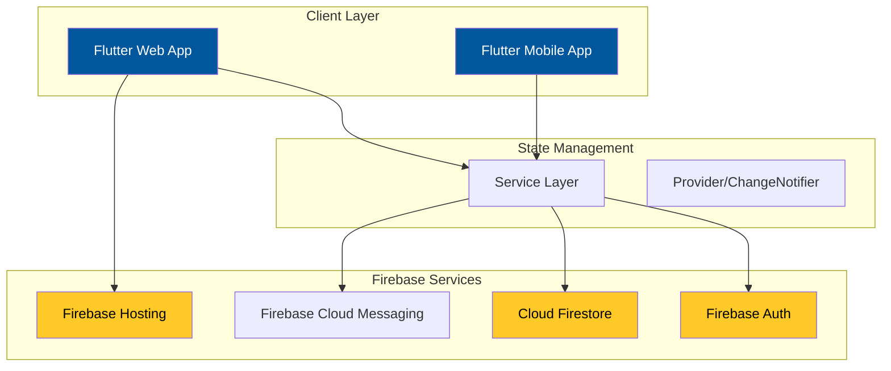
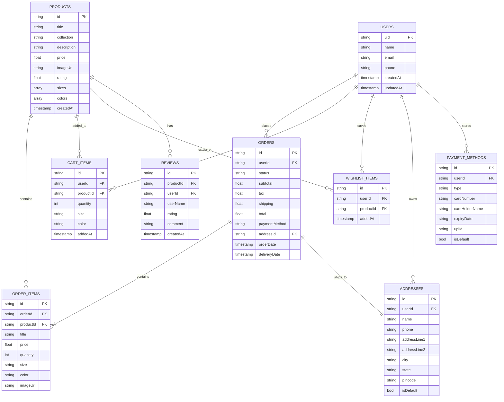
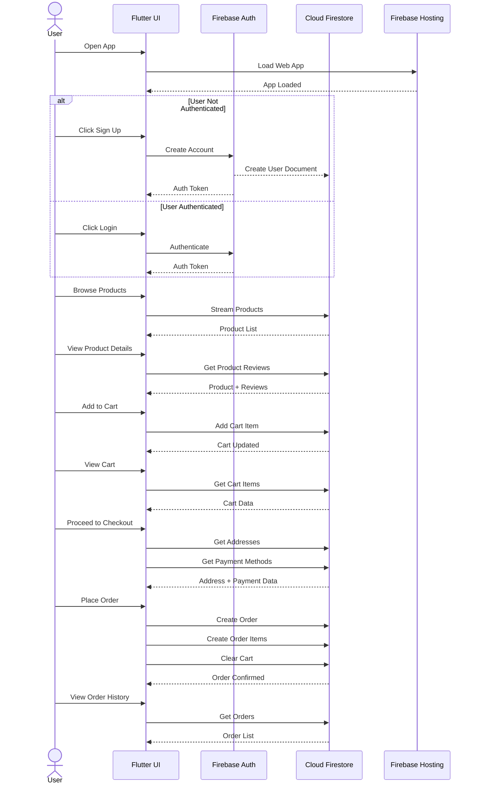

# TRENDIFY - Premium Fashion E-Commerce App

[](https://flutter.dev)
[](https://firebase.google.com)
[](https://trendify-fashion-store.web.app)

A full-stack Flutter e-commerce application for fashion retail, featuring real-time data synchronization, secure authentication, and cloud deployment.


## 🌐 Live Demo

**Experience the app live:** [https://trendify-fashion-store.web.app](https://trendify-fashion-store.web.app)

---

## 📋 Table of Contents

- [Architecture](#-architecture)
- [Database Schema](#-database-schema)
- [Application Flow](#-application-flow)
- [Features](#-features)
- [Tech Stack](#-tech-stack)
- [Screenshots](#-screenshots)
- [Getting Started](#-getting-started)
- [Project Structure](#-project-structure)
- [Author](#-author)

---

## 🏗️ Architecture

### Flutter + Firebase Full-Stack Architecture



### Architecture Highlights

| Layer | Technology | Purpose |
|-------|------------|---------|
| **Frontend** | Flutter | Cross-platform UI framework |
| **Backend** | Firebase | Serverless backend services |
| **Database** | Cloud Firestore | NoSQL document database |
| **Authentication** | Firebase Auth | Secure user authentication |
| **Hosting** | Firebase Hosting | Fast global CDN deployment |
| **State Management** | ChangeNotifier | Reactive data flow |

---

## 🗄️ Database Schema

### Firestore Collections Structure



### Collections Overview

| Collection | Description | Key Features |
|------------|-------------|--------------|
| **users** | User profiles | Auth integration, profile data |
| **products** | Product catalog | Categories, pricing, inventory |
| **orders** | Order records | Status tracking, payment info |
| **orderItems** | Order line items | Product snapshots, quantities |
| **cartItems** | Shopping cart | Real-time updates, session persistence |
| **wishlist** | Saved items | User preferences |
| **addresses** | Shipping addresses | Multiple addresses per user |
| **paymentMethods** | Saved payments | Secure payment info storage |
| **reviews** | Product reviews | Ratings and feedback |

---

## 🔄 Application Flow

### User Journey: Registration → Purchase



### Key Interactions

1. **Authentication Flow**: Firebase Auth handles user registration/login with email/password
2. **Real-time Data**: Firestore streams provide live updates for cart, orders, and products
3. **Transaction Safety**: Order creation uses batched writes for data consistency
4. **Offline Support**: Firestore offline persistence enables app usage without connectivity

---

## ✨ Features

### 🔐 Authentication
- Email/Password Registration & Login
- Google Sign-In Integration
- Secure Password Reset
- Persistent User Sessions

### 🛍️ E-Commerce Core
- Product Catalog with Categories
- Product Details with Images, Sizes, Colors
- Shopping Cart Management
- Wishlist Functionality
- Order History & Tracking

### 💳 Checkout & Payments
- Multiple Payment Methods (Card, UPI, COD)
- Address Management
- Order Summary & Confirmation
- Payment Method Persistence

### 🎨 UI/UX
- Responsive Design (Mobile & Web)
- Dark Mode Support
- Custom Theme (Gold & Black Premium Aesthetic)
- Smooth Animations & Transitions

### ⚡ Technical Features
| Feature | Implementation |
|---------|---------------|
| **State Management** | ChangeNotifier (Service Layer) |
| **Database** | Cloud Firestore (NoSQL) |
| **Authentication** | Firebase Auth |
| **Image Handling** | NetworkImage with Caching |
| **Icons** | Material Design Icons |
| **Fonts** | Google Fonts (Poppins) |
| **Deployment** | Firebase Hosting |

---

## 🛠️ Tech Stack

### Frontend
- **Flutter** - UI Framework
- **Dart** - Programming Language
- **Material Design** - UI Components
- **Google Fonts** - Typography

### Backend & Services
- **Firebase Auth** - Authentication
- **Cloud Firestore** - Database
- **Firebase Hosting** - Web Hosting
- **Firebase Cloud Messaging** - Notifications

### Development Tools
- **Android Studio** / **VS Code** - IDE
- **Git** - Version Control
- **Firebase CLI** - Deployment

---

## 📱 Screenshots

*Screenshots will be added here showcasing:*
- Home Screen with Product Grid
- Product Details with Size/Color Selection
- Shopping Cart
- Checkout Flow
- Order History
- User Profile
- Dark Mode

---

## 🚀 Getting Started

### Prerequisites

```bash
# Install Flutter
https://flutter.dev/docs/get-started/install

# Install Firebase CLI
curl -sL https://firebase.tools | bash
```

### Installation

1. **Clone the repository**
```bash
git clone https://github.com/Mohamad-Husni/trendify-fashion-store.git
cd trendify-fashion-store
```

2. **Install dependencies**
```bash
flutter pub get
```

3. **Configure Firebase**
   - Create a Firebase project at [console.firebase.google.com](https://console.firebase.google.com)
   - Add your `google-services.json` (Android) and `GoogleService-Info.plist` (iOS)
   - Enable Authentication and Firestore

4. **Run the app**
```bash
# For Web
flutter run -d chrome

# For Mobile
flutter run
```

5. **Build for production**
```bash
flutter build web --release
firebase deploy
```

---

## 📁 Project Structure

```
trendify-fashion-store/
├── android/                  # Android specific
├── ios/                      # iOS specific
├── lib/
│   ├── main.dart            # App entry point
│   ├── firebase_options.dart # Firebase configuration
│   ├── models/              # Data models
│   │   ├── product.dart
│   │   ├── cart_item.dart
│   │   ├── order.dart
│   │   └── user.dart
│   ├── screens/             # UI screens
│   │   ├── home_screen.dart
│   │   ├── product_listing_screen.dart
│   │   ├── product_details_screen.dart
│   │   ├── cart_screen.dart
│   │   ├── checkout_screen.dart
│   │   ├── orders_screen.dart
│   │   ├── profile_screen.dart
│   │   └── settings_screen.dart
│   ├── services/            # Business logic
│   │   ├── auth_service.dart
│   │   ├── cart_service.dart
│   │   ├── order_service.dart
│   │   ├── payment_service.dart
│   │   ├── product_service.dart
│   │   └── wishlist_service.dart
│   ├── theme/               # App theming
│   │   └── app_theme.dart
│   ├── utils/               # Utilities
│   │   └── firebase_seeder.dart
│   └── widgets/             # Reusable widgets
│       ├── custom_button.dart
│       ├── custom_text_field.dart
│       └── product_card.dart
├── assets/                   # Images and fonts
│   └── images/
├── web/                      # Web specific
│   ├── index.html
│   └── manifest.json
├── pubspec.yaml             # Dependencies
├── firebase.json            # Firebase config
└── README.md                # This file
```

---

## 🔗 Firebase Configuration

### Required Firestore Indexes

Create these composite indexes in Firebase Console:

| Collection | Fields | Purpose |
|------------|--------|---------|
| products | collection (Asc), createdAt (Desc) | Category filtering |
| orderItems | orderId (Asc), createdAt (Desc) | Order detail queries |
| cartItems | userId (Asc), addedAt (Desc) | Cart management |

### Security Rules

```javascript
rules_version = '2';
service cloud.firestore {
  match /databases/{database}/documents {
    // User documents - users can only access their own data
    match /users/{userId} {
      allow read, write: if request.auth != null && request.auth.uid == userId;
      
      // Subcollections inherit parent rules
      match /{document=**} {
        allow read, write: if request.auth != null && request.auth.uid == userId;
      }
    }
    
    // Products - public read, admin write
    match /products/{productId} {
      allow read: if true;
      allow write: if request.auth != null && 
        request.auth.token.admin == true;
    }
    
    // Reviews - authenticated users
    match /reviews/{reviewId} {
      allow read: if true;
      allow create: if request.auth != null;
      allow update, delete: if request.auth != null && 
        request.auth.uid == resource.data.userId;
    }
  }
}
```

---

## 👤 Author

**Mohamad Husni**

- GitHub: [@Mohamad-Husni](https://github.com/Mohamad-Husni)
- LinkedIn: [Your LinkedIn Profile]
- Email: [your.email@example.com]

---

## 📝 License

This project is licensed under the MIT License - see the [LICENSE](LICENSE) file for details.

---

## 🙏 Acknowledgments

- Flutter Team for the amazing framework
- Firebase for comprehensive backend services
- Google Fonts for beautiful typography
- Material Design for UI guidelines

---

<p align="center">
  <strong>⭐ Star this repo if you found it helpful!</strong>
</p>

<p align="center">
  <a href="https://trendify-fashion-store.web.app">
    
  </a>
</p>
